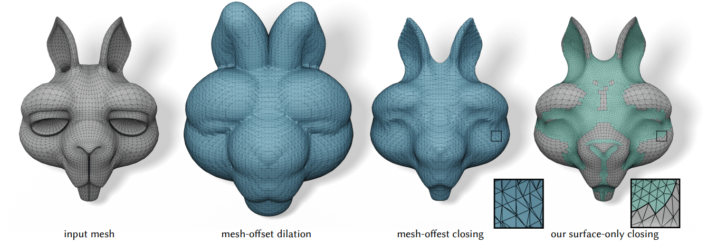

</img>

[](https://pypi.org/project/closing-flow)
[](https://opensource.org/licenses/MIT)

# closing_flow

A Python Implementation
of "[Opening and Closing Surfaces](https://dgp.toronto.edu/~sgsellan/pdf/opening-and-closing-surfaces.pdf)".

## Installation

```bash
pip install closing-flow
```

## Usage

```python
import igl
import closing_flow

vs, fs = igl.read_triangle_mesh("data/handle_input.obj")
out_vs, out_fs = closing_flow.closing_flow(
    vs, fs, maxiter=300, remesh_iterations=1, h=0.005, bd=1 / 0.08, dt=0.001, tol=1e-5)
igl.write_triangle_mesh("data/handle_output.obj", out_vs, out_fs)
```

## References

```bibtex
@article{Sellan:Opening:2020,
  title = {Opening and Closing Surfaces},
  author = {Silvia Sell{\{a}}n and Jacob Kesten and Ang Yan Sheng and Alec Jacobson},
  year = {2020},
  journal = {ACM Transactions on Graphics},
}
```